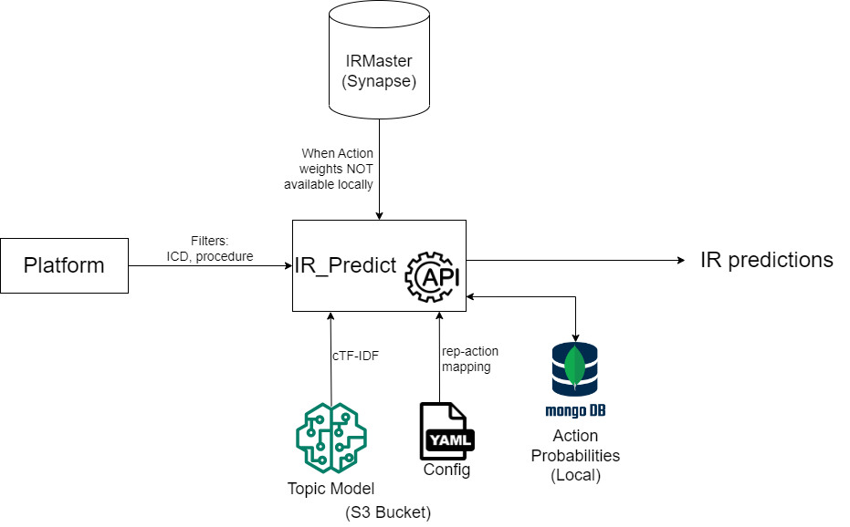

# IR_predition_components
## Summary

This repository contains all the components required for IR predictions based on filter values received from platform. The repository will be moved to an API-setting once a working and development in this repository will be discontinued.

## Solution Flowchart

